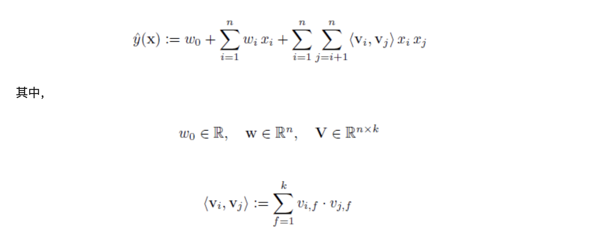
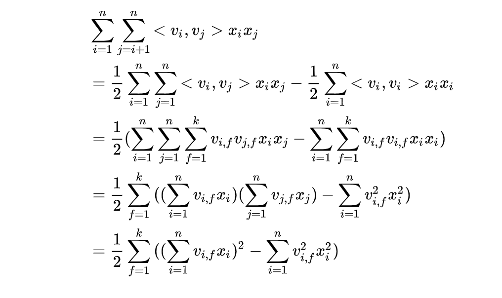

#### 两个核心细节

掌握FM，有两个细节需要注意：参数量级的变化和时间复杂度的变化。

首先对于参数量级，由线性模型到多项式模型到FM模型参数量级变化为：

n-->n*n-->kn (k<<n)

其次是由原始FM公式到化简之后的FM公式复杂度的变化情况为：

Kn*n-->kn

#### 线性模型

回归问题我们一般使用的比较见得baseline就是线性回归，二元分类问题就是逻辑回归LR。

线性模型公式如下（回归问题）：

对于线性模型，我们的假设一般是认为特征之间是相互独立的，无法学习到特征之间的交叉影响。

为了解决特征交叉的问题，我们一般可以人为的加入一些自己的先验信息，比如做一些特征之间的交互，不过这个很需要人们的经验。

#### POLY2模型--暴力组合特征交叉

这个时候，POLY2模型成了可行的方案。POLY2 模型，对所有特征做了两两交叉，并对所有特征组合赋予了权重，在一定程度上解决了特征组合问题，本质仍然是线性模型，训练方法与逻辑回归没有区别。

我们把POLY2（只是特征两两交叉的部分）加到线性模型中，从而模型可以过渡到多项式模型，公式如下：

（ps：看到这里我自己有一个疑问，同一个特征onehot之后，会在自己里面做特征交叉吗）

看这个公式，主要是看后面那个交叉的部分。看到这部分，其实很容联想到我们在LR中自己加入交叉特征的部分。

但是需要注意的是，这里有点像暴力求解一样，忽视或者说省去了人工先验的部分，直接做到了所有特征之间的交叉，然后去求解对应的参数就可以。

##### POLY2模型两个问题

但是这样暴力求解存在两个问题：参数量和参数稀疏导致学习困难的问题。

先说参数量的问题，如果我自身特征（未交叉之前）就已经很多了，为n，那么交叉之后就是一个 n*n级别的参数量。极端情况会出现参数的量级比样本量级都大，训练起来及其的困难。

再说参数稀疏的问题。互联网数据通常使用one-hot编码除了类别型数据，从而使特征向量极度稀疏，POLY2模型做无选择的特征交叉，使得特征向量更加的稀疏，导致大部分交叉特征的权重缺乏有效的数据进行训练，无法收敛。

我自己理解的时候感觉这个很像是NLP中OOV情况。

#### FM模型

面对这两种问题，FM模型怎么解决呢？

FM相比于POLY2模型，主要区别是用两个向量的内积代替了单一权重系数，具体来说，就是FM为每个特征学习了一个隐权重向量。在特征交叉的时候，使用两个特征向量的内积作为交叉特征的权重。

这样其实就解决了上面两个问题。

参数量的问题变为了 kn个参数，因为每个特征对应一个K维度的向量。

其次是参数学习的问题。OOV问题很大缓解，即使当前特征交叉在训练样本中没出现过，但是每个特征已经学到了自己embedding，内积之后是有结果的。这也是为什么FM模型泛化能力强的根本原因。

FM模型如下：

其中涉及到的二阶部分可以通过公式的化简从Kn*n-->kn：

参考链接：

文章：

FM算法解析 - 王多鱼的文章 - 知乎 https://zhuanlan.zhihu.com/p/37963267

推荐系统召回四模型之：全能的FM模型 - 张俊林的文章 - 知乎 https://zhuanlan.zhihu.com/p/58160982

代码：

deepctr-torch 大概跑了一遍