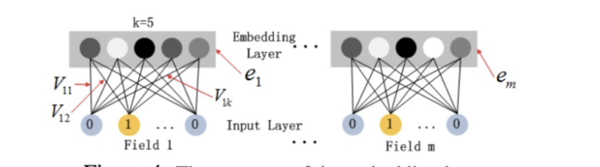

在理解DeepFM的时候，我觉得有个细节点非常重要，就是FM中对应的特征组合前面的每个特征的隐向量在哪里？

每个原始类别特征会进行one-hot，然后映射到embedding层，每个节点链接到embedding层的权重组合就是这个隐向量。直接看图：

对于DeepFM，核心概括一下：

DeepFM大致分为两个部门：DNN和FM部门，两者共享权值，分别提取特征，最终这输出。

FM分为一阶特征组合和二阶特征交叉组合。特征一般分为类别型特征和连续性特征。

我大致跑了一下DeepFM的代码，看了一下一阶特征和二阶特征的问题：

一阶特征是类别型特征和连续特征都要，类别型特征直接embedding相加就可以，连续特征归一化之后乘以对应权重相加就可以，最终一起相加就可以。

二阶特征组合是是使用到了离散特征的组合，直接embedding之后放入到FM模型中就可以。

参考链接：

深度推荐模型之DeepFM - 偶而君的文章 - 知乎 https://zhuanlan.zhihu.com/p/57873613

deepFM in pytorch----非常好
https://blog.csdn.net/w55100/article/details/90295932