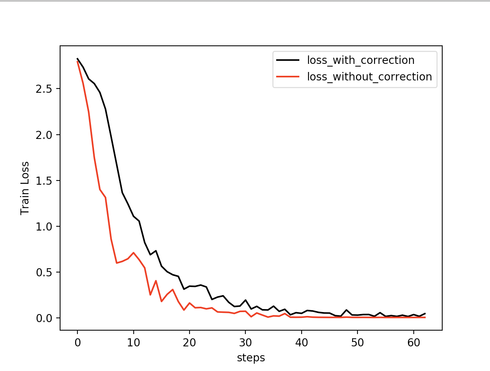
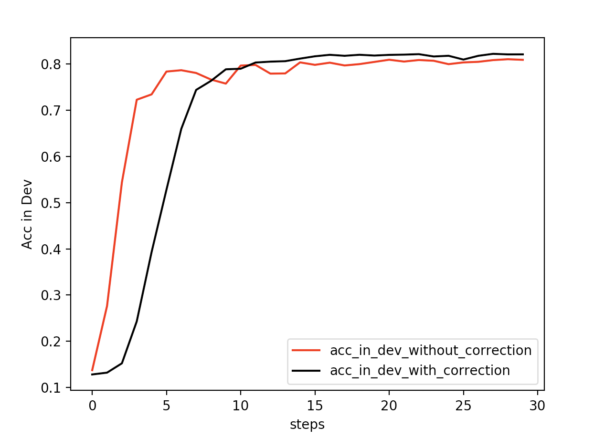
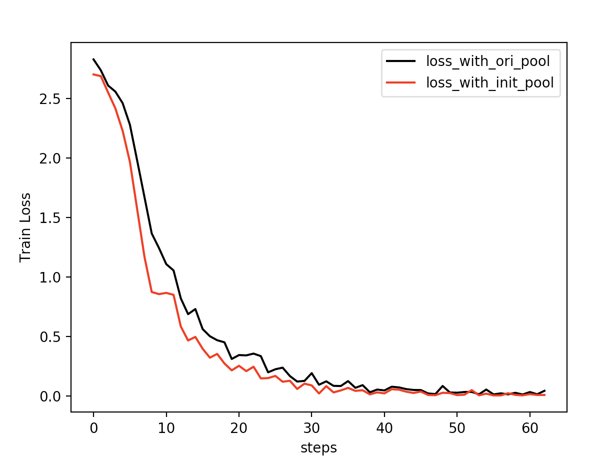

## Pytorch代码分析--如何让Bert在finetune小数据集时更“稳”一点

前几天在知乎刷到邱震宇同学的一个文章，如何让 Bert 在 finetune 小数据集时更“稳”一点，主要是分析了一篇论文，感觉很有意思。

小数据集的时候，很容易就训练震荡。作者主要是是分析了两个点进行优化。一个是adam偏移修正的问题，一个是权重初始化的问题。

作者通过实验给出的结论是：1.使用误差修正，训练效率提高（收敛变快），开发集效果变好。2.使用权重初始化（后6层），训练效率提高（收敛变快），开发集效果变化不大。

我做了简单的测试，有一个小点和作者结论不太一样，adam的修正并没有加速模型收敛，具体的看正文分析吧。

我基于 <font color="#666600">huggingface</font> 的 Bert，做了个两个简单的实验，详细情况如下。

### 1. adam偏移修正

对于adam偏移修正的实验，我这边得到的结果是：使用误差修正，收敛并未变快，训练更加稳定，开发集效果变好。

对于收敛速度这块和作者结论不太一样，多跑了几个种子，都是收敛速度并未变快，希望有关大佬解惑。

#### 1.1 代码情况讲解

首先说一下，在翻看源代码的时候，发现对于抱抱脸的 Bert 的实现，默认偏移修正是开启的，具体代码的位置在这里：

https://github.com/huggingface/transformers/blob/84be482f6698fac822a5113735f2242c6d3abc76/src/transformers/optimization.py#L107

代码如下
```python
class AdamW(Optimizer):

    def __init__(self,...,correct_bias=True):
    ...
    ...
```

所以在测试偏移修正的对比的实验的时候，一个是保持默认不变得出一个结果；一个是修改这个参数，你可以在调用函数的时候修改参数传入值，也可以修改源代码，如果是修改的源代码，记得做完实验把代码改回来，别对之后工作造成影响。

#### 1.2 任务基本情况

任务基本情况是这样的：

- 任务类别：文本分类/15个类别
- 数据来源: 今日头条新闻数据
- 数据量级：训练集1K/开发集50k
- 训练参数：
  - <font color="#0000dd">Bert : chinese_l-12_h-768_a-12，使用原始版本未做修改</font>
  - <font color="#0000dd">batchsize：16</font>
  - <font color="#0000dd">max_seq_length ：128</font>
  - <font color="#0000dd">learning_rate：2e-5</font>
  - <font color="#0000dd">Epoches: 10</font>

因为数据量较小，并且想要观察变化，没使用 earlly stopping，完整的跑完了10个epoch，一共是 600 steps 左右，文中所示图以每隔 10 steps 打点显示，所以最大显示为 60/30。

#### 1.3 结果展示

结果展示分为两个，一个是 Loss 变化图，一个是在开发集 Acc 展示图。

Loss 变化如下图：



可以看到，没有使用偏移纠正的 loss 收敛的更加的迅速一点，反而使用了修正的模型收敛的慢一点。但是同时可以观测到，修正之后，模型的收敛更加的稳定，相比较而言，并没有特别大的震荡。

Acc变化如下图（后期没怎么变化，所以截取了前300steps）：



对于在开发集来说，经过修正的收敛速度慢，但是比较稳定，没有大幅度的震荡，准确度相比，有可观收益（图中看不不太明显，无修正最好效果:0.80，加入修正最好效果: 0.82）

### 2. 权重初始化

权重初始化比较简单，平常任务也试过，因为是文本分类任务，所以在这里只是简单的测试了一下重新初始化 Pooler 层。

Loss结果如下图：



从图中可以看出，重新初始化，收敛速度变快了，但是不明显。

Acc没什么变化，就不上图了，没什么变化（主要是被我无意删了，懒得再重跑一次了，不影响大局）

### 3. 简单总结

简单总结一下：

与没有修正的adam之后，修正之后，模型收敛速度变慢，收敛过程变得稳定，效果提升比较明显。

与没有重新初始化的模型相比，初始化最后一层pooler之后，模型收敛速度有所变快，但是不明显，效果也没有明显变化。

上面这两个实验只是基于邱震宇同学的文章做的，在这里感谢作者。关于收敛速度这里，结果有一点不一样，希望有大佬可以解惑，我也会抽空去看看原论文，仔细研读一下，看论文还有没有值得挖的东西，有任何进展，我再和大家说。

打完收工，看完我这么辛苦画图（真是累死了）的份上，点个赞再撤吧，鞠躬感谢。