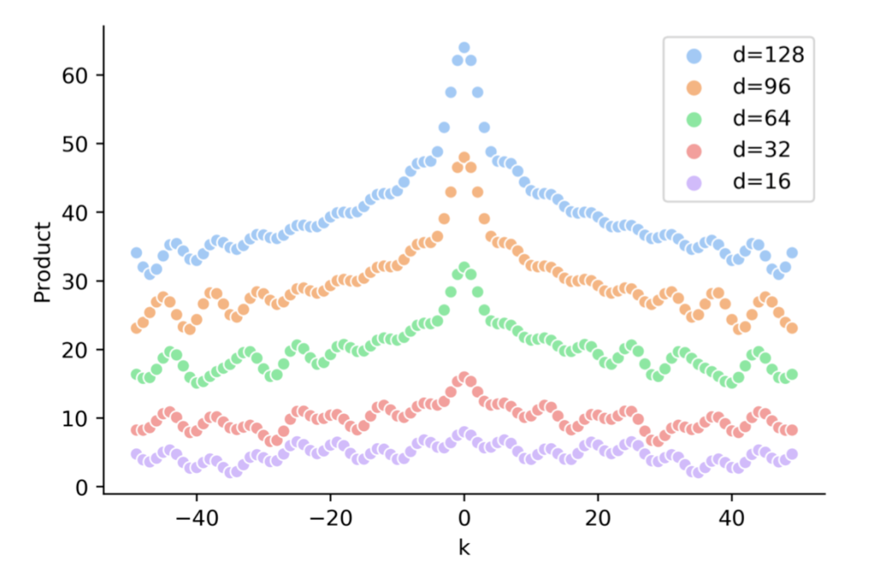
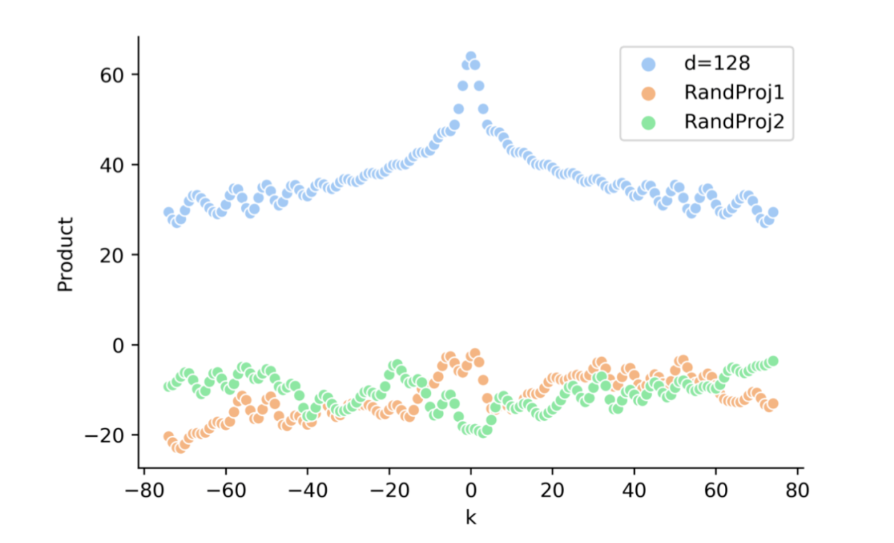

原版Transformer的位置编码究竟有没有包含相对位置信息。

不涉及到公式推导，面试的时候能大致说出来就可以，很少会让推导，尽最大可能让大家明白

#### 简单概述

Transformer 原版的位置编码也就是正余弦函数编码，表达的是绝对位置信息，同时包含相对位置信息。但是经过线性变化，相对位置信息消失。基于此，需要对位置编码进行优化。

#### 正文

原版位置编码使用的是正余弦函数，通过三角函数，可以得出一个结论就是：$PE_{pos+k}$可以被$PE_{pos}$线性表示。

从这一点来说，原版位置编码可以反应一定的相对位置信息。

接下来，我们来看，经过注意力层，这个相对位置信息还在不在？

很简单，把词向量和位置向量作为输入，经过注意力层，然后因式分解，得到四个部分，我们重点关注包含两个不同位置编码的公式部分，形式如下：

$PE_{pos}^{T}W_{q}^{T}W_{k}PE_{pos+k} \tag{1}$

我们想要证明，这个公式能不能反应相对位置信息。

为了解决这个问题，我们化繁为简，先从下面这个公式入手：

$PE_{pos}^{T}PE_{pos+k} \tag{2}$

注意看公式(1)和公式(2)的区别，在中间多了两个矩阵相乘，这两个矩阵，是我们的Q/K矩阵，可以看做是一个线性变化，记住这个细节点。

经过公式推导，我们很容易知道公式(2)最后的结果只和两个位置的相对位置 $k$ 相关，这个结果是包含相对位置信息。也就是说两个不同位置$PE$的点积的结果可以反映相对距离。

通过实验我们知道这个结果大小随着相对距离的增大而减小，值得注意的是它并不能反映相对位置的方向，因为他是一个对称的。

具体的我们可以看下面这个图：

很好，接下来，我们就是证明本来可以反映相对位置信息的公式(2)，在加上中间这个线性变化之后，相对位置信息还在不在。

直接看效果图：

这个图需要重点看的下面两个，也就是加了线性变化之后，变化趋势从最上面蓝色图标的线变成了下面两条线，也就是趋势已经完全没有了。

也就是说，实验结果显示，公式(1)的结果随着 k 的变化没有明显的趋势变化，也就是说相对位置信息消失了。

上面这些内容，估计5分钟左右吧，本来想加上相对位置编码，不过内容也挺多的，下回再发吧。

同学们，如果觉写的还行，给个在看。

参考链接：

[一文读懂Transformer模型的位置编码](https://mp.weixin.qq.com/s/QxaZTVOUrzKfO7B78EM5Uw)

这个文章写的不错，主要是给出来正余弦函数表达相对信息的公式推导

[浅谈Transformer模型中的位置表示](https://mp.weixin.qq.com/s/vXYJKF9AViKnd0tbuhMWgQ)

哈工大的SCIR写的文章，不错，从正余弦函数位置信息和相对位置信息和transformerx-l都讲出来了

[Transformer改进之相对位置编码RPE](https://mp.weixin.qq.com/s/NPM3w7sIYVLuMYxQ_R6PrA)

这个文章很好，讲了位置编码的几种优化，值得好好看看推导一下公式

[如何优雅地编码文本中的位置信息？三种positioanl encoding方法简述](https://mp.weixin.qq.com/s/ENpXBYQ4hfdTLSXBIoF00Q)

夕小瑶的文章，讲了三种位置编码，还可以，没事的时候可以看看

[[相对位置编码一)Relative Position Representatitons RPR - Transformer](https://www.cnblogs.com/shiyublog/p/11185625.html)

大佬讲了一下相对位置编码，很好，推荐

[相对位置编码(二) Relative Positional Encodings - Transformer-XL](https://www.cnblogs.com/shiyublog/p/11236212.html)

大佬讲的transformer-xl，推荐