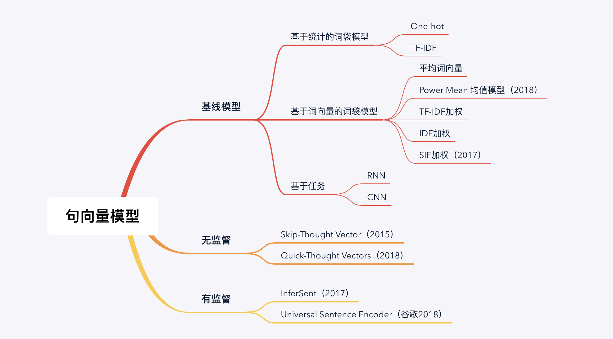

问：如何判断”今天你吃饭了“和”今天去哪里吃饭“这两个句子的相似度？

上面这个问题，就是我们为什么需要句子向量的原因。神经网络或者其他的机器学习方法很难直接对中文进行处理，我们需要对句子使用一定的方法进行数字化或者向量化。

我在讲词向量的时候，说了一个很好的比喻，向量化的过程就非常的类似计算机把我们的输入转为二进制以便处理的过程。

只不过二进制的转化我们是可以规定，而向量化的过程根据我们任务不同目标不同，有着多种方法。

我简单花了一个概述图，大家可以看一下：

**1.基线模型**

**1.1 基于统计的词袋模型**

One-hot 模型简单来说就是单词出现的位置为1，不出现的位置为0，形如[1,1,1,0,1],来将句子向量化。

TF-IDF 使用到了单词在句子中出现的词频和在所有文档中出现的频率。相比于One-hot，增加了单词重要性这个维度的特征，所以效果一般来说比One-hot要好。

**1.2 基于词向量的词袋模型**

为什么使用词向量这个特征？相较于One-hot和TF-IDF，词向量能够提取语义信息。

对词向量最简单的操作就是求平均获取句子的表征。对于词向量，一般可以使用Word2vec/Fasttext/Glove。后期Bert出现之后，我们也可以使用Bert的最后一层（或者某一层）的输出作为词向量。但是效果有待商榷。

简单求均值简单粗暴，优化方法就是使用各种方法进行加权求均值。

我们可以使用TF-IDF对词向量做加权求和获得句子的表征。为了简便，我们也可以去掉TF，只是使用IDF做加权求和。

对于SIF模型，它分为两个步骤。首先使用平滑倒词频为权重求和，随后减去所有句子的共有信息，获得的结果作为句子表征。

对于Power Mean 均值模型，它引入了幂均值改进加权求均值，通过修改不同的P值拼接不同的句子向量得到最后的句子表征。

以上都属于我们词袋模型求得句子向量。词袋模型存在一个最大问题，就是忽略了或者没有那么重视句子的语序问题，不管你是不是有用到词向量。

**1.3基于任务**

我们来看一下基于任务的，分为RNN和CNN。举个简单的例子，我们使用RNN和CNN做文本分类任务，然后使用最后一个时刻或者最后一层（或者你使用其他方式）作为句子的向量。

这种方式很好，但是存在的问题就是句子向量的表达严重依赖任务形式。

我们用文本分类训练出现的句子向量如果还是用在文本分类任务，效果可能还不错，但是如果用在情感分析任务上，可能就一塌糊涂。

这是因为我们的模型是依赖于任务的，文本分类模型侧重点和情感分类的侧重点是不同的，导致模型参数也应该是不相同的。

所以基于任务的句子向量模型迁移性比较差。

**2. 无监督模型**

无监督模型最大的好处就是可以不使用标签数据。这一点真的很重要。

当然我想提一点就是我这里说的无监督模型是做的是端到端。其实本质上，我们使用基于词袋的模型，也属于无监督模型。仔细想一下是不是这个道理，词袋模型同样没有使用到标签数据。

拉回来，我们说端到端的无监督模型。主要谈两个：Skip-Thought Vectors 和 Quick-Thought Vectors。

Skip-Thought Vectors 模型输入为三个连续的句子，然后使用Encoder-Decoder模型，输入中间的句子，分别生成上一个句子和下一个句子。这个过程非常类似于Word2vec。

Quick-Thought Vectors 是对Skip-Thought Vectors 的改进。首先说为啥需要改进，最大的原因就是 Skip-Thought Vectors 太慢了。首先它是一个生成任务。生成任务在预测阶段很难并行。其次他是做了两个生成任务，一个是上一个句子的生成，一个是下一个句子的生成。

Quick-Thought Vectors把生成任务改为了分类任务，Decoder从一组句子中选择出正确的上/下一个句子。

**3. 有监督**模型

InferSent模型注意两个细节点就可以。首先就是使用的是自然语言推理（NLI）数据集上训练 Sentence Embedding。

这一点其实很重要，作者是认为从这个数据集上训练出来的词向量是可以很好的被迁移到别的任务上的。

其次使用的是LSTM或者其他模型对句子进行编码，作者在论文中对不同编码模型有详细比较。

Universal Sentence Encoder 使用多任务，通过在不同的数据集和不同的任务上同时训练，动态地适应各种的 NLP 任务。Encoder使用两种模型，一个是Transformer，是为了获取更高的精度，另一个事DAN (Deep Averaging Network）为了获得更快的速度

**已经尽了最大努力缩减内容，提取重点了，接下来会用几篇文章详细的谈一谈其中的部分模型。**

**写文不易，点个在看或者赞让更多人看到吧，谢谢。**