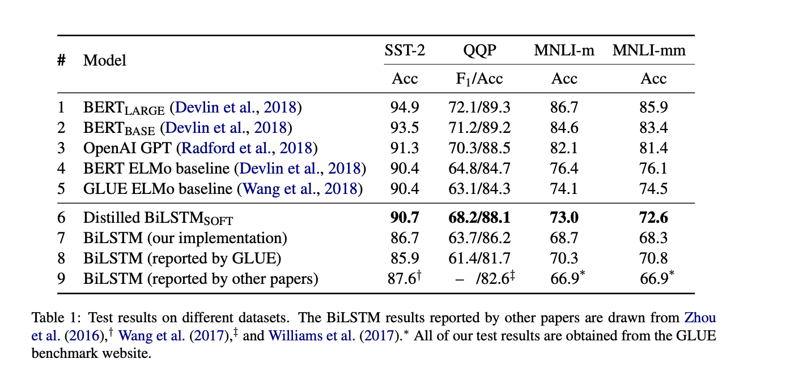

假如手上有一个文本分类任务，我们在提升模型效果的时候一般有以下几个思路：

1. 增大数据集，同时提升标注质量

2. 寻找更多有效的文本特征，比如词性特征，词边界特征等等

3. 更换模型，使用更加适合当前任务或者说更加复杂的模型，比如FastText-->TextCNN--Bert

...

之后接触到了知识蒸馏，学习到了简单的神经网络可以从复杂的网路中学习知识，进而提升模型效果。

之前写个一个文章是TextCNN如何逼近Bert，当时写得比较粗糙，但是比较核心的点已经写出来。

这个文章脱胎于这个论文：Distilling Task-Specific Knowledge from BERT into Simple Neural Networks

整个训练过程是这样的：

1. 在标签数据上微调Bert模型
2. 使用三种方式对无标签数据进行数据增强
3. Bert模型在无标签数据上进行推理，Lstm模型学习Bert模型的推理结果，使用MSE作为损失函数。

#### 目标函数

知识蒸馏的目标函数：

一般来说，我们会使用两个部分，一个是硬目标损失函数，一个是软目标损失函数，两者都可以使用交叉熵进行度量。

在原论文中，作者在计算损失函数的时候只是使用到了软目标，同时这个软目标并不是使用softmax之前的logits进行MSE度量损失，也就是并没有使用带有温度参数T的sotmax进行归一化。

#### 数据增强

为了促进有效的知识转移，我们经常需要一个庞大的，未标记的数据集。

三种数据增强的方式：

1. Masking：使用概率$P_{mask}$随机的替换一个单词为[MASK].

   需要注意的是这里替换之后，Bert模型也会输入这个数据的。从直觉上来讲，这个规则可以阐明每个单词对标签的影响。

2. POS-guided word replacement.使用概率$P_{pos}$随机替换一个单词为另一个相同POS的单词。这个规则有可能会改变句子的语义信息。

3. n-gram sampling

整个流程是这样的：对于每个单词，如果概率p<$p_{mask}$，我们使用第一条规则，如果p<$p_{mask}+p_{pos}$，我们使用第二条规则，两条规则互斥，也就是同一个单词只使用两者之间的一个。当对句子中的每个单词都过了一遍之后，我进行第三条规则，之后把整条句子补充道无标签数据集中。

#### 知识蒸馏结果图

效果图：

