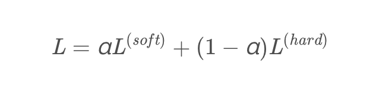
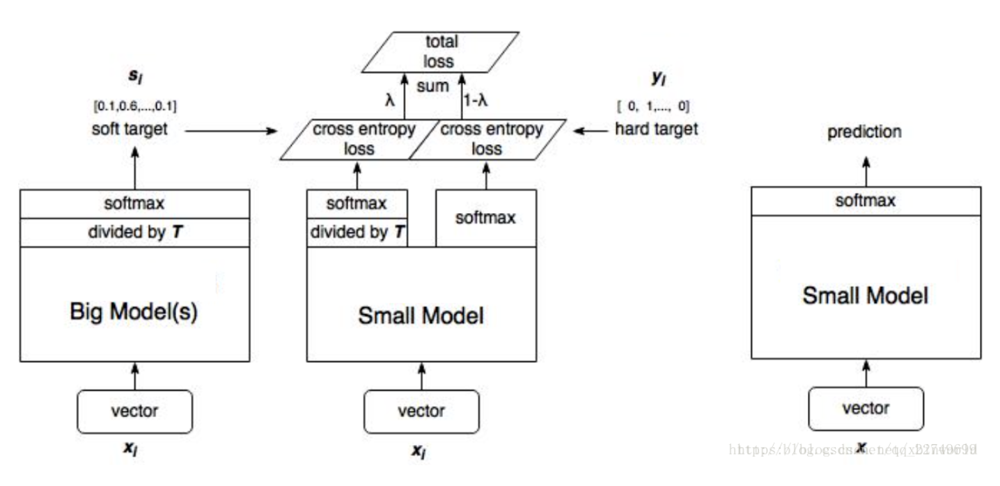

Bert知识蒸馏系列(一)：什么是知识蒸馏

全文参考的论文是：Distilling the Knowledge in a Neural Network

参考的讲解的比较的博文是：

《Distilling the Knowledge in a Neural Network》知识蒸馏 - musk星辰大海的文章 - 知乎
https://zhuanlan.zhihu.com/p/75031938

这个含有Hiton的PPT介绍

【经典简读】知识蒸馏(Knowledge Distillation) 经典之作 - 潘小小的文章 - 知乎
https://zhuanlan.zhihu.com/p/102038521

这个把其中的公式推导写的比较明白

如何理解soft target这一做法？ - YJango的回答 - 知乎
https://www.zhihu.com/question/50519680/answer/136406661

Bert 系列文章

1. Bert 模型压缩

    什么是知识蒸馏？知识蒸馏基础概念一览。

2. Bert 的后续改进
    Albert
    Robert

#### 什么是蒸馏

一般来说，为了提高模型效果，我们可以使用两种方式。一种是直接使用复杂模型，比如你原来使用的TextCNN，现在使用Bert。一种是多个简单模型的集成，这种套路在竞赛中非常的常见。

这两种方法在离线的时候是没有什么问题的，因为不涉及到实时性的要求。但是一旦涉及到到部署模型，线上实时推理，我们需要考虑时延和计算资源，一般需要对模型的复杂度和精度做一个平衡。

这个时候，我们就可以将我们大模型学到的信息提取精华灌输到到小模型中去，这个过程就是蒸馏。

#### 什么是知识

对于一个模型，我们一般关注两个部分：模型架构和模型参数。

简答的说，我们可以把这两个部分当做是我们模型从数据中学习到的信息或者说是知识（当然主要是参数，因为架构一般来说是训练之前就定下来的）

但是这两个部分，对于我们来说，属于黑箱，就是我们不知道里面究竟发生了什么事情。

那么什么东西是我们肉眼可见的呢？从输入向量到输出向量的一个映射关系是可以被我们观测到的。

简单来说，我输入一个example，你输出是一个什么情况我是可以看到的。

区别于标签数据格式 [0,0,1,0],模型的输出结果一般是这样的：[0.01,0.01,0.97,0.01]。

举个比较具象的例子，就是如果我们在做一个图片分类的任务，你的输入图像是一辆宝马，那么模型在宝马这个类别上会有着最大的概率值，与此同时还会把剩余的概率值分给其他的类别。

这些其他类别的概率值一般都很小，但是仍然存在着一些信息，比如垃圾车的概率就会比胡萝卜的概率更高一些。

模型的输出结果含有的信息更丰富了，信息熵更大了，我们进一步的可以把这种当成是一种知识，也就是小模型需要从大模型中学习到的经验。

这个时候我们一般把大模型也就是复杂模型称之为老师网络，小模型也就那我们需要的蒸馏模型称之为学生网络。学生网络通过学习老师网络的输出，进而训练模型，达到比较好的收敛效果。

#### 为什么知识蒸馏可以获得比较好的效果

在前面提到过，卡车和胡萝卜都会有概率值的输出，但是卡车的概率会比胡萝卜大，这种信息是很有用的，它定义了一种丰富的数据相似结构。

上面谈到一个问题，就是不正确的类别概率都比较小，它对交叉熵损失函数的作用非常的低，因为这个概率太接近零了，也就是说，这种相似性存在，但是在损失函数中并没有充分的体现出来。

第一种就是，使用sofmax之前的值，也就是logits，计算损失函数

第二种是在计算损失函数的时候，使用温度参数T，温度参数越高，得到的概率值越平缓。通过升高温度T，我们获取“软目标”，进而训练小模型

其实对于第一种其实是第二种蒸馏方式的的一种特例情况，论文后续有对此进行证明。

这里的温度参数其实在一定程度上和蒸馏这个名词相呼应，通过升温，提取精华，进而灌输知识。

#### 带温度参数T的Softmax函数

软化公式如下：

说一下为什么需要这么一个软化公式。上面我们谈到，通过升温T，我们得到的概率分布会变得比较平缓。

用上面的例子说就是，宝马被识别为垃圾车的概率比较小，但是通过升温之后，仍然比较小，但是没有那么小（好绕口啊）。

也就是说，数据中存在的相似性信息通过升温被放大了，这样在计算损失函数的时候，这个相似性才会被更大的注意到，才会对损失函数产生比较大的影响力。

#### 损失函数

损失函数是软目标损失函数和硬目标损失函数的结合，一般来说，软目标损失函数设置的权重需要大一些效果会更好一点。

#### 如何训练

整体的算法示意图如下：

整体的算法示意图如上所示：

1. 首先使用标签数据训练一个正常的大模型
2. 使用训练好的模型，计算soft targets。
3. 训练小模型，分为两个步骤，首先小模型使用相同的温度参数得到输出结果和软目标做交叉熵损失，其次小模型使用温度参数为1，和标签数据（也就是硬目标）做交叉损失函数。
4. 预测的时候，温度参数设置为1，正常预测。