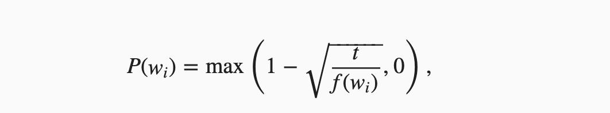

Word2vec为什么需要二次采样？

说到 Word2vec 的采样，首先会想起来的是负采样，属于对Word2vec的一个近似训练方法。

其实它还涉及到一个采样方法，就是subsampling，中文叫做二次采样。
用最简单的一句话描述二次采样就是，对文本中的每个单词会有一定概率删除掉，这个概率是和词频有关，越高频的词越有概率被删掉。
二次采样的公式如下所示：

注意: t为超参数，分母 f(w) 为单词w的词频与总词数之比

首先说一下，我们需要对文本数据进行二次采样？
举个简单例子，“他/是/个/优秀/的/学生”。如果此时中心词为"学生"，背景词为"的"。

那么，我们的背景词对于我们这个中心词其实是没有什么作用的，并没有什么语义信息上的补充。

但是像“的”这种高频词，出现的机会还很大，所以对于这一句话信息是存在冗余的。
也就是说，在一个背景窗口中，一个词和较低频词同时出现比和较高频词同时出现对训练词嵌入模型更有益。

举个生活中的例子，现实生活中自律优秀的人比较少，堕落不努力人的人比较多，当然是优秀的人出现在我们身边会对我们自身的成长更加的有益。

所以我们的想法就是减少和堕落的人出现的次数，远离他们，让优秀的人出现在我们生活中的概率上升。

那么二次采样之后文本数据变成了什么样子？

还是上面那句话，“他/是/个/优秀/的/学生”，在这个时候，就变成了“他/是/个/优秀/学生”。也就是说高频词“的”在我们的训练数据中消失了。

当然这个消失正如上文所说，是一个概率，可能在之后的另一个句子中，它还是存在的，只不过它出现在文本中的词频肯定是降低了的。