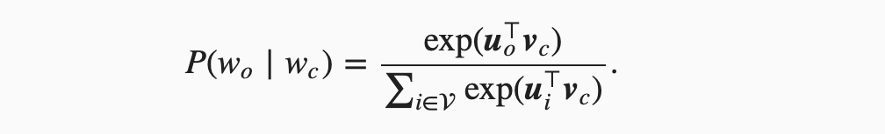
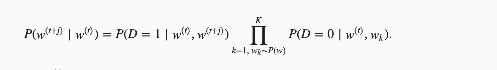

**总结不易，请大力点赞，感谢**

上一个文章，[Word2vec-负采样/霍夫曼之后模型是否等价-绝对干货](http://mp.weixin.qq.com/s?__biz=MzIyNTY1MDUwNQ==&mid=2247483837&idx=1&sn=9b334c5db352acc298aa6bb0e5e41ce9&chksm=e87d339bdf0aba8d1e79d7ef88461a6914d0a74330e744b501394d7ad9aa0c1d8a65382ce80b&scene=21#wechat_redirect)是字节的面试真题，建议朋友们多看几遍，有问题及时沟通。

私下有几个朋友看完之后还是有点懵，又问了一下具体细节。基于此，我重新写了一个简短的文章，希望能让大家明白，大家可以结合上一个文章看。

我们再看一下题目：W2V经过霍夫曼或者负采样之后，模型与原模型相比，是等价的还是相似的？

首先，我们要明确，这里的原模型指的是什么？原模型就是我们的没有经过优化的W2V（当然我们也说过它是一个工具不是一个模型）。

也就是只是使用Skip-gram模型或者CBOW模型而没有进行优化的原始版本。对于这个原始版本，是在最后一层进行了Softmax。

我们的目标函数中，最核心的一个部分就是在给定中心词的条件下生成正确背景词的概率，我们要最大化这个东西，公式如下：

仔细看，在分母涉及到了一个V，这里的V就是我们的词典大小。也就是说，为了计算这个条件概率，我们需要对整个词典进行操作，复杂度就是O(|V|)

所以，负采样和霍夫曼就是针对这一个计算开销大的地方进行了优化。当然W2V为了减少计算量，还是去掉了隐层。比如CBOW直接是输入向量求和平均然后接霍夫曼树。比如Skip-gram直接是中心词的词向量接霍夫曼树。

这不是我这个文章的重点，就不细细展开了。

我们先说负采样。负采样的本质在于生成K个噪声。它的本质是基于中心词生成正确的背景词概率为1，生成噪声词概率为0，这个是我们的优化方向。公式如下：

仔细看这个公式，V已经消失，取而代之的是K，也就是我们的噪声词的数量，换句话讲，我们的复杂度被K这个大小限制住了，降低为了O(|K|)

然后我们再来看层序Softmax。它的核心本质是在一条路径上不停的做二分类，概率连乘就会得到我们的条件概率。公式如下：

注意看，这个公式中，V也已经消失了，被霍夫曼树中到达背景词的路径限制住了，这也就是上个文章中说到的，复杂度变成了二叉树的高度: O(log|V|)

既然只是针对的部分节点，那么与原始版本相比，当然是近似。

简单的总结一下：

其实可以这样理解，以跳字模型为例，条件概率是中心词生成背景词的概率，也就是我们优化函数中最核心的部分。没有使用优化的，分母涉及到全部词汇，训练开销大。负采样近似训练，把复杂度限制在了k个噪声词，层序softmax也属于近似训练，在它的条件概率中，不断的二分类，涉及到的是能够达到背景词的那个路径上的非叶子结点，也就是没涉及到其他节点，这一点和负采样很类似，都是从全部词汇降低复杂度，只不过负采样是被k限制，层序是被路径编码限制(0,1,1,1,0)这种限制住。

**不知道大家有没有注意到，负采样和霍夫曼都是讲Softmax转化为二分类的问题从而降低了复杂度。负采样是针对是不是背景词做二分类，霍夫曼是在对是不是正确路径上的节点做二分类。这么说有点不严谨，但是意思就是这么个意思，大家理解一下。**

**总结不易，请大力点赞，感谢**